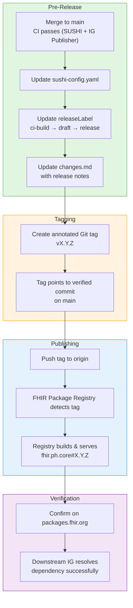

# Version Release Workflow

This page describes the formal process for releasing new versions of the PH Core Implementation Guide. The workflow ensures that every release is traceable, reproducible, and discoverable by downstream IGs via the [FHIR Package Registry](https://packages.fhir.org/fhir.ph.core).

## Release Philosophy

PH Core follows [semantic versioning](https://semver.org/) adapted for FHIR Implementation Guides:

| Bump | When to use | Example |
|------|-------------|---------|
| **Patch** (0.0.1) | Bug fixes, validation corrections, documentation typos | Fix QA error, correct binding strength |
| **Minor** (0.1.0) | New profiles, extensions, or value sets; non-breaking additions | Add PHCoreCondition profile |
| **Major** (1.0.0) | Breaking changes to existing profiles, canonical URL changes, FHIR version upgrade | Rebase to FHIR R5 |

## Release BPMN Diagram



## Step-by-Step Procedure

### 1. Pre-Release Checklist

Before tagging, ensure all of the following are complete:

- [ ] `main` branch builds cleanly: `sushi .` returns **0 Errors, 0 Warnings**
- [ ] IG Publisher builds successfully: `./_genonce.sh` or `./_build.sh` (option 2)
- [ ] QA report (`output/qa.html`) has no errors and only acceptable warnings
- [ ] All new profiles have examples
- [ ] `sushi-config.yaml` has correct `version` and `releaseLabel` values
- [ ] `changes.md` is updated with release notes for this version

### 2. Update sushi-config.yaml

```yaml
# Before (development)
version: 0.2.0
releaseLabel: ci-build

# After (release preparation)
version: 0.3.0
releaseLabel: draft   # or 'release' for final
```

Valid `releaseLabel` values per FHIR IG publishing:
- `ci-build` — continuous integration, not published
- `draft` — working draft for ballot or review
- `release` — stable, published version

### 3. Create the Tag

```bash
cd ~/Github/ph-core

# Fetch latest main
git pull origin main

# Create annotated tag
git tag -a v0.3.0 -m "v0.3.0 - Stabilization Release"

# Push tag to origin (triggers registry)
git push origin v0.3.0
```

### 4. Verify Registry Publication

1. Wait 5–15 minutes for the [FHIR Package Registry](https://packages.fhir.org/fhir.ph.core) to process the tag.
2. Visit `https://packages.fhir.org/fhir.ph.core` and confirm the version appears.
3. Test resolution from a downstream IG or HAPI FHIR server:
   ```yaml
   dependencies:
     fhir.ph.core: 0.3.0
   ```

### 5. Post-Release

- [ ] Announce in PH Core Development chat
- [ ] Update downstream IGs (eReferral, NHDR) to reference the new version
- [ ] Reset `releaseLabel` to `ci-build` on `main` for continued development

---

## Version History

For a chronological list of all releases, see the [Changes](changes.html) page.

---

## References

- [FHIR Package Registry](https://packages.fhir.org/fhir.ph.core)
- [SUSHI Configuration](https://fshschool.org/docs/sushi/configuration/)
- [AU Core Version History](https://hl7.org.au/fhir/core/2.0.0/changes.html)
- [Semantic Versioning](https://semver.org/)
