# Version Release Workflow

This page describes the formal process for releasing new versions of the PH Core Implementation Guide. The workflow ensures that every release is traceable, reproducible, and discoverable by downstream IGs.

## Overview

A PH Core release is **not** just a Git tag. It is a multi-stage process involving:

1. **Git tag** → triggers CI/CD
2. **CI/CD build** → runs SUSHI + IG Publisher, produces `output/`
3. **GitHub Pages publish** → versioned directory (`gh-pages/X.Y.Z/`)
4. **FHIR IG Registry** → PR to `FHIR/ig-registry` `fhir-ig-list.json`
5. **Package Registry** → `packages.fhir.org` indexes the published package

> **Key distinction**: The [FHIR Package Registry](https://packages.fhir.org) and the [FHIR IG Registry](https://github.com/FHIR/ig-registry) are **separate** systems. The Package Registry serves `.tgz` packages; the IG Registry lists published guides with their canonical URLs and history pages.

---

## Release Philosophy

PH Core follows [semantic versioning](https://semver.org/) adapted for FHIR Implementation Guides:

| Bump | When to use | Example |
|------|-------------|---------|
| **Patch** (0.0.1) | Bug fixes, validation corrections, documentation typos | Fix QA error, correct binding strength |
| **Minor** (0.1.0) | New profiles, extensions, or value sets; non-breaking additions | Add PHCoreCondition profile |
| **Major** (1.0.0) | Breaking changes to existing profiles, canonical URL changes, FHIR version upgrade | Rebase to FHIR R5 |

---

## Release BPMN Diagram

```mermaid
flowchart TB
    subgraph PRE["Pre-Release"]
        A1["Merge to main<br/>CI passes (SUSHI + IG Publisher)"]
        A2["Update changes.md<br/>with release notes"]
        A3["Reset releaseLabel<br/>ci-build → release"]
    end

    subgraph TAG["Tagging"]
        B1["Create annotated Git tag<br/>vX.Y.Z"]
        B2["Tag points to verified commit<br/>on main"]
    end

    subgraph BUILD["CI/CD Build"]
        C1["Trigger: push tag v*"]
        C2["Patch sushi-config.yaml<br/>version + releaseLabel"]
        C3["Run SUSHI + IG Publisher"]
        C4["Produce output/ artifacts"]
    end

    subgraph PAGES["GitHub Pages"]
        D1["Checkout gh-pages branch"]
        D2["Copy output/ → gh-pages/X.Y.Z/"]
        D3["Update /current/ redirect"]
        D4["Update history.html"]
        D5["Update package-list.json"]
        D6["Update index.html landing page"]
    end

    subgraph REGISTRY["FHIR Registries"]
        E1["PR to FHIR/ig-registry<br/>fhir-ig-list.json"]
        E2["packages.fhir.org<br/>indexes package"]
    end

    subgraph VERIFY["Verification"]
        F1["Confirm gh-pages/X.Y.Z/ renders"]
        F2["Confirm package-list.json valid"]
        F3["Downstream IG resolves<br/>fhir.ph.core#X.Y.Z"]
    end

    A1 --> A2 --> A3 --> B1
    B1 --> B2 --> C1
    C1 --> C2 --> C3 --> C4 --> D1
    D1 --> D2 --> D3 --> D4 --> D5 --> D6 --> E1
    E1 --> E2 --> F1 --> F2 --> F3

    style PRE fill:#e1f5e1,stroke:#4caf50
    style TAG fill:#fff3e0,stroke:#ff9800
    style BUILD fill:#e3f2fd,stroke:#2196f3
    style PAGES fill:#fff8e1,stroke:#ffc107
    style REGISTRY fill:#fce4ec,stroke:#e91e63
    style VERIFY fill:#f3e5f5,stroke:#9c27b0
```



---

## Step-by-Step Procedure

### 1. Pre-Release Checklist

Before tagging, ensure all of the following are complete:

- [ ] `main` branch builds cleanly: `sushi .` returns **0 Errors, 0 Warnings**
- [ ] IG Publisher builds successfully: `./_genonce.sh` or `./_build.sh` (option 2)
- [ ] QA report (`output/qa.html`) has no errors and only acceptable warnings
- [ ] All new profiles have examples
- [ ] `changes.md` is updated with release notes for this version
- [ ] `package-list.json` exists (or will be auto-generated by CI/CD)

### 2. Update `sushi-config.yaml`

```yaml
# Before (development)
version: 0.2.0
releaseLabel: ci-build

# After (release preparation)
version: 0.3.0
releaseLabel: release
```

Valid `releaseLabel` values per FHIR IG publishing:
- `ci-build` — continuous integration, not published
- `draft` — working draft for ballot or review
- `release` — stable, published version

### 3. Create the Tag

```bash
cd ~/Github/ph-core

# Fetch latest main
git pull origin main

# Create annotated tag
git tag -a v0.3.0 -m "v0.3.0 - Stabilization Release"

# Push tag to origin (triggers CI/CD)
git push origin v0.3.0
```

### 4. CI/CD Build & Publish

The `ig-release.yml` workflow (or equivalent) performs:

1. **Patch `sushi-config.yaml`** → sets `version` and `releaseLabel: release`
2. **Install dependencies** → Node.js, SUSHI, Java 21, Jekyll, Graphviz
3. **Download IG Publisher** → `input-cache/publisher.jar`
4. **Run IG Publisher** → `java -jar publisher.jar ig.ini`
5. **Publish to `gh-pages`**:
   - Copy `output/` → `gh-pages/X.Y.Z/`
   - Update `/current/` redirect to latest release
   - Update `history.html` with all releases
   - Update `package-list.json` (FHIR package feed)
   - Update `index.html` landing page

> **Anti-overwrite protection**: The CI/CD refuses to overwrite an existing release directory.

### 5. Register in FHIR IG Registry

PH Core is **not yet** registered in the [FHIR IG Registry](https://github.com/FHIR/ig-registry). To register:

1. Fork `https://github.com/FHIR/ig-registry`
2. Edit `fhir-ig-list.json` and add an entry:
   ```json
   {
     "name": "PH Core",
     "category": "National Base",
     "npm-name": "fhir.ph.core",
     "description": "Philippine Core FHIR Implementation Guide defines minimum expectations for data commonly exchanged across Philippine health systems.",
     "authority": "UP Manila National TeleHealth Center",
     "country": "ph",
     "language": ["en"],
     "history": "https://UP-Manila-SILab.github.io/ph-core/history.html",
     "canonical": "https://fhir.doh.gov.ph/phcore",
     "ci-build": "https://build.fhir.org/ig/UP-Manila-SILab/ph-core",
     "editions": [
       {
         "name": "Baseline",
         "ig-version": "0.1.0",
         "package": "fhir.ph.core#0.1.0",
         "fhir-version": ["4.0.1"],
         "url": "https://UP-Manila-SILab.github.io/ph-core/0.1.0"
       },
       {
         "name": "Profile Expansion",
         "ig-version": "0.2.0",
         "package": "fhir.ph.core#0.2.0",
         "fhir-version": ["4.0.1"],
         "url": "https://UP-Manila-SILab.github.io/ph-core/0.2.0"
       },
       {
         "name": "Stabilization",
         "ig-version": "0.3.0",
         "package": "fhir.ph.core#0.3.0",
         "fhir-version": ["4.0.1"],
         "url": "https://UP-Manila-SILab.github.io/ph-core/0.3.0"
       }
     ]
   }
   ```
3. Submit a PR to `FHIR/ig-registry`

> **Note**: The registry maintainers check JSON validity via CI. Invalid JSON will be rejected.

### 6. Verify Publication

1. Wait 5–15 minutes for CI/CD to complete.
2. Confirm `gh-pages/X.Y.Z/` renders at `https://UP-Manila-SILab.github.io/ph-core/X.Y.Z/`
3. Confirm `https://UP-Manila-SILab.github.io/ph-core/current/` redirects to the latest release.
4. Confirm `package-list.json` is valid (FHIR tooling can parse it).
5. Confirm downstream IGs can resolve the dependency:
   ```yaml
   dependencies:
     fhir.ph.core: 0.3.0
   ```

### 7. Post-Release

- [ ] Announce in PH Core Development chat
- [ ] Update downstream IGs (eReferral, NHDR) to reference the new version
- [ ] Reset `releaseLabel` to `ci-build` on `main` for continued development
- [ ] Update the FHIR IG Registry entry if this is a new edition

---

## CI/CD Reference

The release workflow is modeled after the [PH eReferral IG Release Workflow](https://github.com/jgsuess/ph-ereferral/blob/main/.github/workflows/ig-release.yml) by Jörn Guy Süß (CSIRO).

Key features of the CI/CD:
- **Trigger**: `push` tags matching `v*`
- **Version derivation**: Extracts version from tag (`v0.3.0` → `0.3.0`)
- **Dynamic patching**: Python script patches `sushi-config.yaml` at build time
- **Idempotent**: Refuses to overwrite an existing release
- **Auto-generated pages**: `history.html`, `index.html`, `package-list.json`

---

## Version History

For a chronological list of all releases, see the [Changes](changes.html) page.

---

## References

- [FHIR Package Registry](https://packages.fhir.org/fhir.ph.core)
- [FHIR IG Registry](https://github.com/FHIR/ig-registry)
- [SUSHI Configuration](https://fshschool.org/docs/sushi/configuration/)
- [AU Core Version History](https://hl7.org.au/fhir/core/2.0.0/changes.html)
- [Semantic Versioning](https://semver.org/)
- [PH eReferral IG Release Workflow](https://github.com/jgsuess/ph-ereferral/blob/main/.github/workflows/ig-release.yml)
