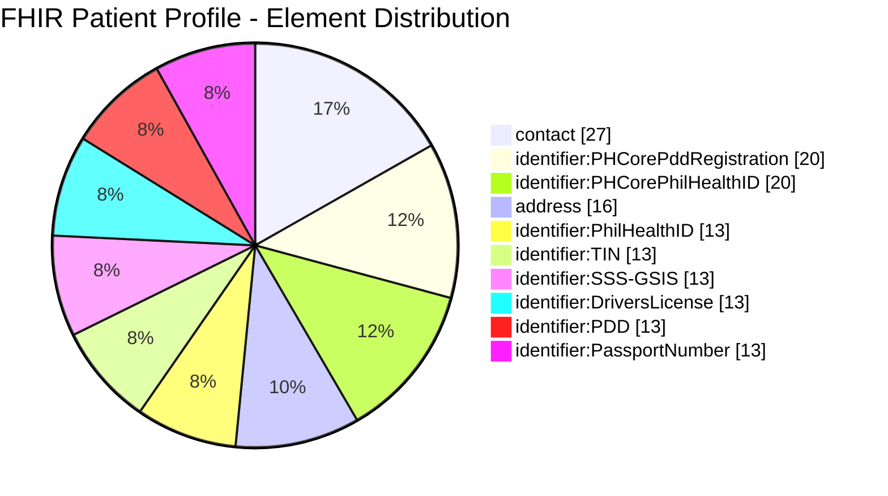
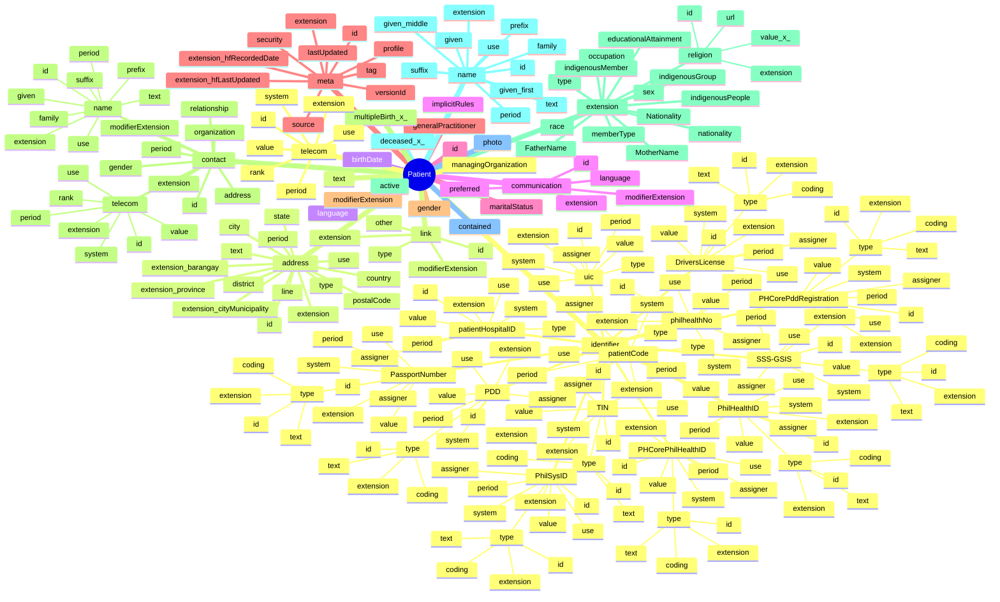

# FHIR Patient Profile - Structure Visualization

This document provides visual representations of the FHIR Patient profile structure based on the patient.csv file.

## Treemap View

The following treemap shows the distribution of elements in the Patient profile:

## Simplified Hierarchy

This diagram shows the main elements of the Patient profile and their immediate children:

```mermaid
graph TD;
    PATIENT[Patient]
    PATIENT --> Patient[Patient]
    Patient --> Patient_communication[communication]
    Patient --> Patient_contact[contact]
    Patient --> Patient_link[link]
    Patient --> Patient_name[name]
    Patient --> Patient_address[address]
    Patient --> Patient_telecom[telecom]
    Patient --> Patient_identifier_PHCorePddRegistration[identifier_PHCorePddRegistration]
    Patient --> Patient_identifier_PhilHealthID[identifier_PhilHealthID]
    Patient --> Patient_identifier_PHCorePhilHealthID[identifier_PHCorePhilHealthID]
    Patient --> Patient_identifier_TIN[identifier_TIN]
    Patient --> Patient_meta[meta]
    Patient --> Patient_identifier_SSS-GSIS[identifier_SSS-GSIS]
    Patient --> Patient_identifier_DriversLicense[identifier_DriversLicense]
    Patient --> Patient_extension_religion[extension_religion]
    Patient --> Patient_identifier_PDD[identifier_PDD]
    Patient --> Patient_identifier_PassportNumber[identifier_PassportNumber]
    Patient --> Patient_identifier_patientHospitalID[identifier_patientHospitalID]
    Patient --> Patient_identifier_PhilSysID[identifier_PhilSysID]
    Patient --> Patient_identifier_uic[identifier_uic]
    Patient --> Patient_identifier_patientCode[identifier_patientCode]
    Patient --> Patient_identifier_philhealthNo[identifier_philhealthNo]
```

## Detailed Hierarchy

This diagram shows a more detailed view of the Patient profile structure:

---
Generated from `utils/patient.csv` using tree_paths.py
